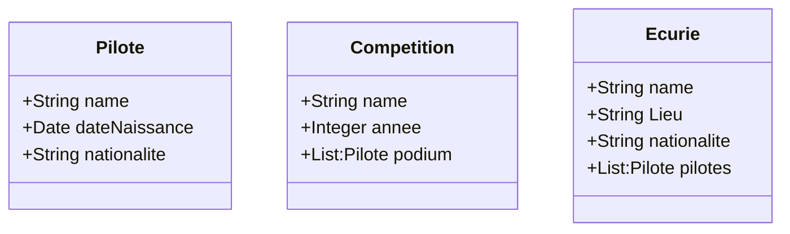

# ClientServeurNoSQL

## Présentation ## 

Ce projet à pour but de lister les différents pilotes de F1, d'énumérer leurs palmarès au cours du temps et de faire l'historique de chaque écurie.

## Model ## 

