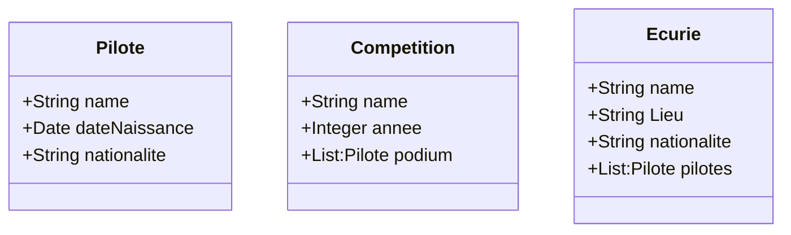

# ClientServeurNoSQL

## Présentation

Ce projet à pour but de lister les différents pilotes de F1, d'énumérer leurs palmarès au cours du temps et de faire l'historique de chaque écurie.

## Fonctionnement 

Grâce à une base de donnée mongo, nous pouvons lister les différents éléments avec des API REST classiques.

## Model

