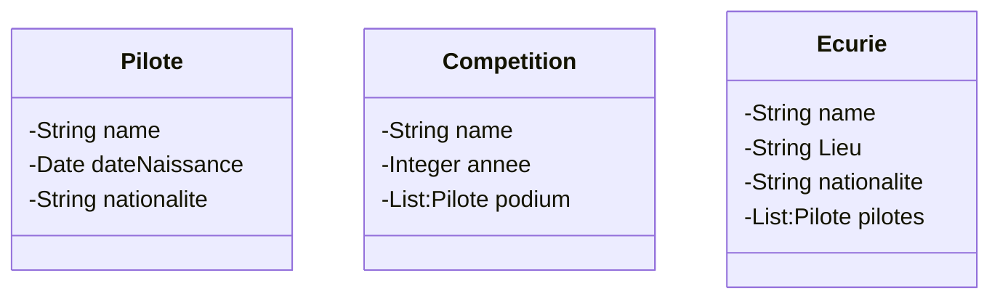

# ClientServeurNoSQL

## Présentation

Ce projet à pour but de lister les différents pilotes de F1, d'énumérer leurs palmarès au cours du temps et de faire l'historique de chaque écurie.

Cela comprend donc des pilotes (avec nom, date de naissance et nationalité), des écurires (avec nom, lieu où elle est implantée, nationalité et une liste de pilotes présent dans l'écurie) et des compétitions (avec nom, année, et podium de la course)

On souhaite donc stocker les résultats pour accéder aux podiums d'une course recherchée, trouver tous les podiums d'un pilote ou encore quelle écurie a gagnée quelle course.

## Fonctionnement 

Afin de réaliser ce travail, nous avons utilisé une base de données mongo pour stocker toutes nos données. Et pour récuprérer ces données, nous avons fais des API REST classiques, accessibles via 'PostmanCollection.json' à la racine du projet.

## Model

